## Context Parallelism (Ring Attention)

[图解大模型训练系列：序列并行3，Ring Attention](https://zhuanlan.zhihu.com/p/4963530231)

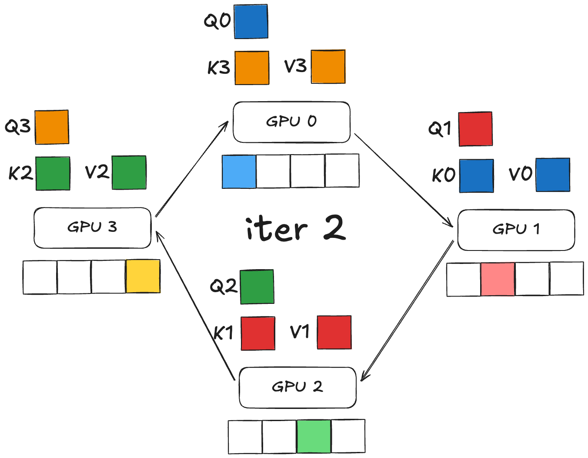
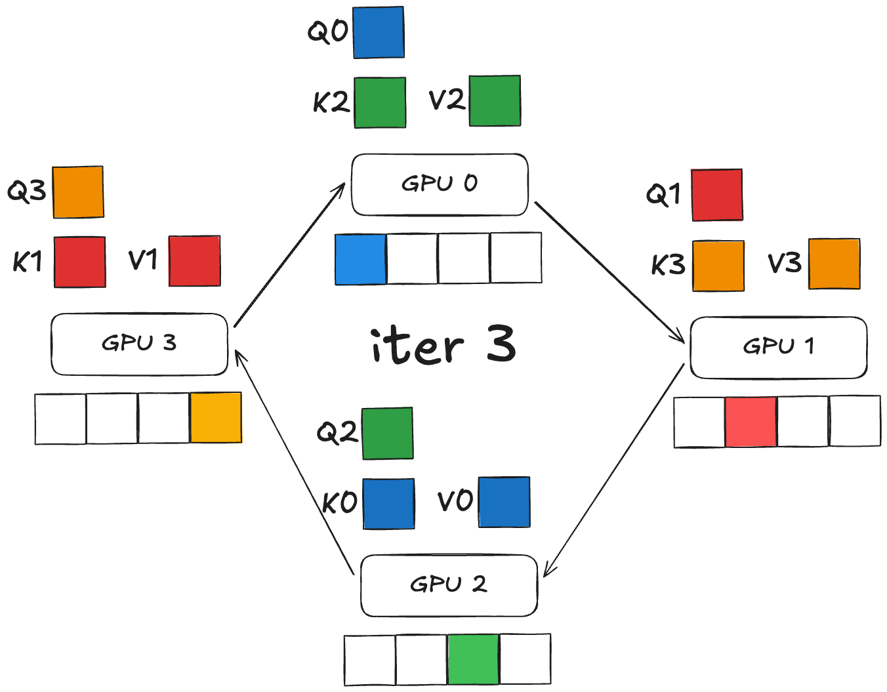
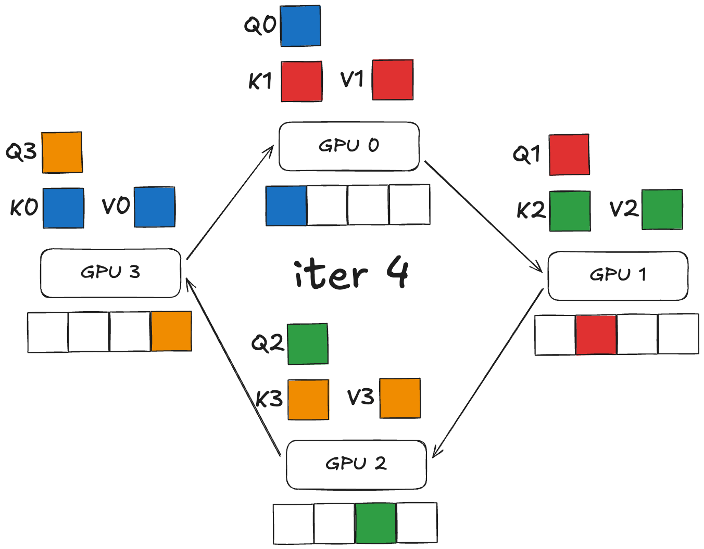
### compute-communication overlap 
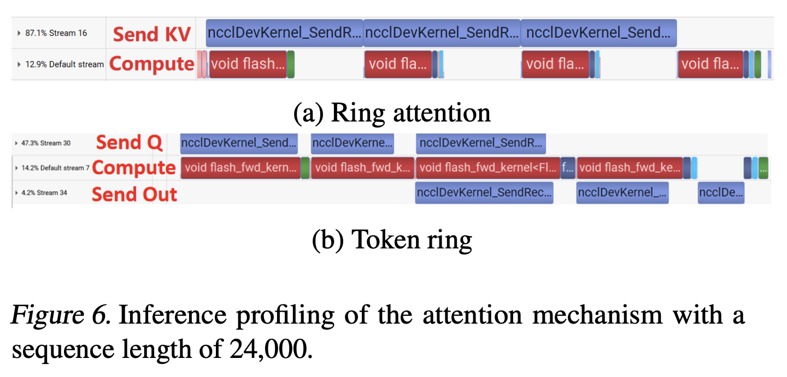
[\[2412.20501v1\] TokenRing: An Efficient Parallelism Framework for Infinite-Context LLMs via Bidirectional Communication](https://arxiv.org/abs/2412.20501v1)
### (\*\*\*) balance in computation 
> [!note]
> Recall that chunking is position irrelevant!!!

[# ring attention + flash attention：超长上下文之路](https://zhuanlan.zhihu.com/p/683714620)
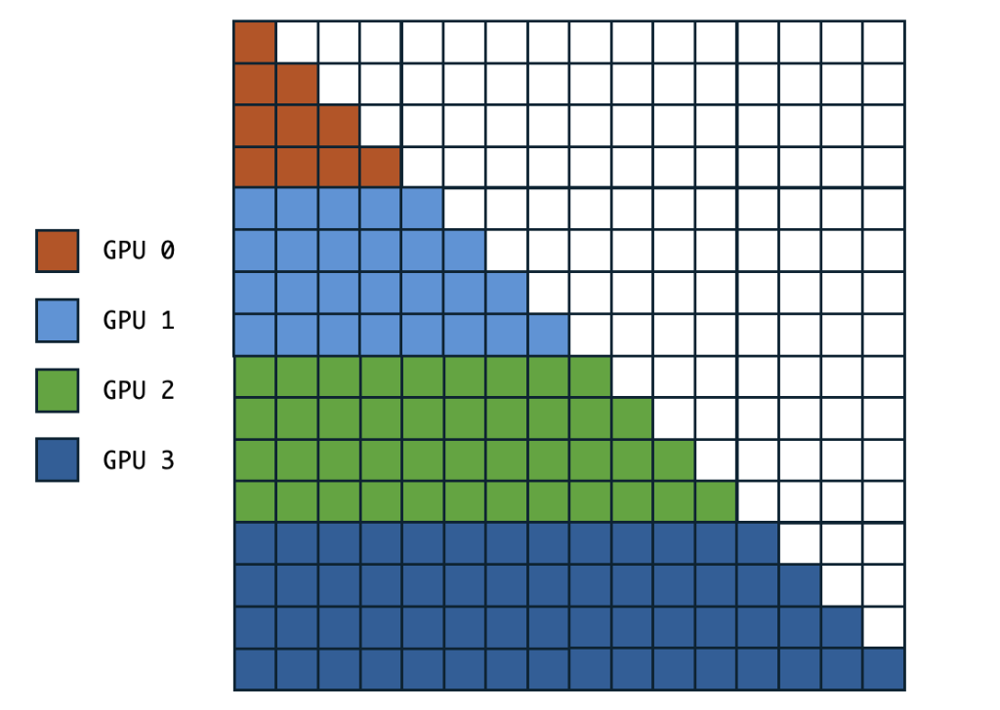
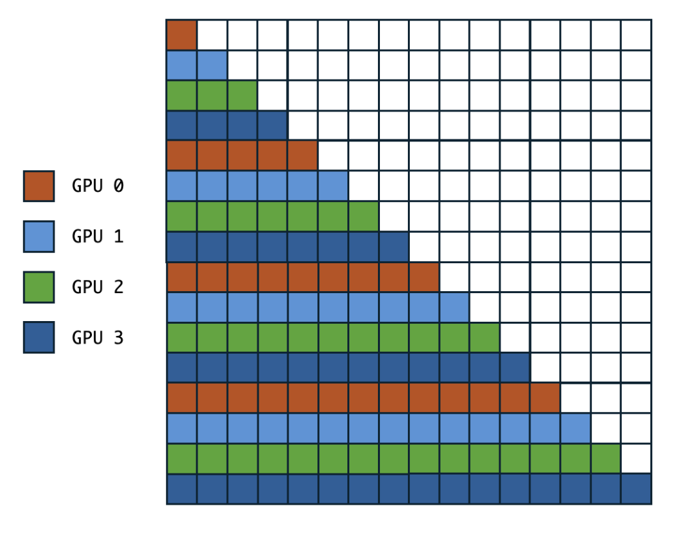
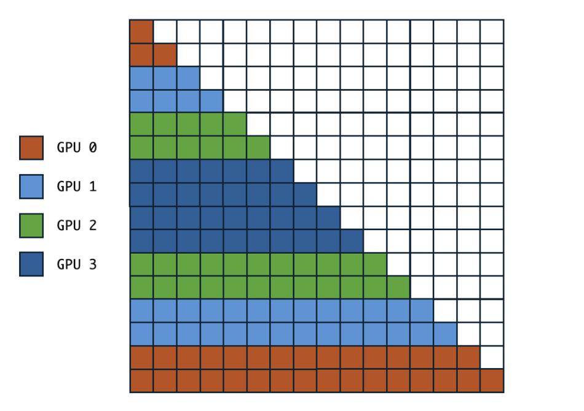

### dynamic chunking (Context Parallelism in training) 
pipeline parallelism 
[Speeding Up Variable-Length Training with Dynamic Context Parallelism and NVIDIA Megatron Core \| NVIDIA Technical Blog](https://developer.nvidia.com/blog/speeding-up-variable-length-training-with-dynamic-context-parallelism-and-nvidia-megatron-core/)
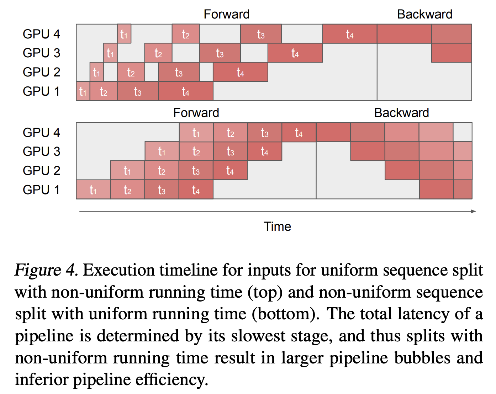
[\[2102.07988\] TeraPipe: Token-Level Pipeline Parallelism for Training Large-Scale Language Models](https://arxiv.org/abs/2102.07988)
## Sequence Parallelism
deepspeed ulysses

**Non-Attention Layer**
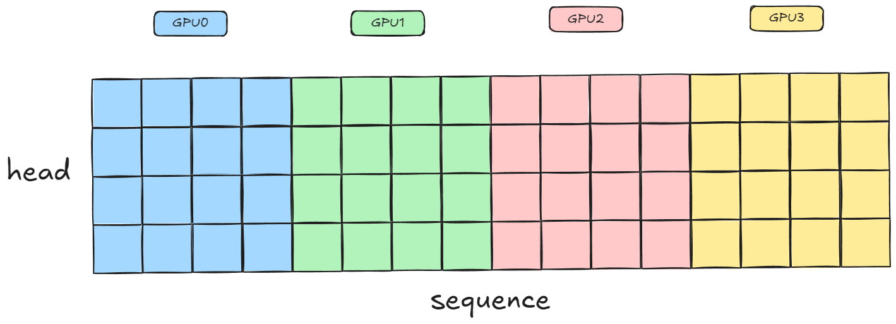
**Attention Layer**
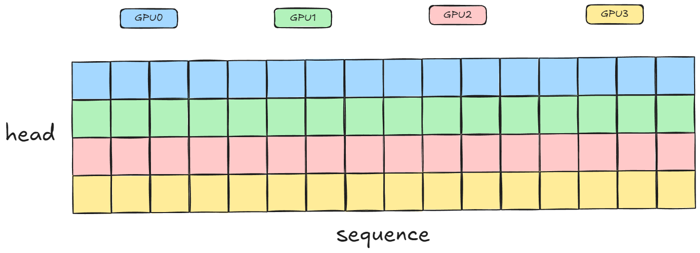
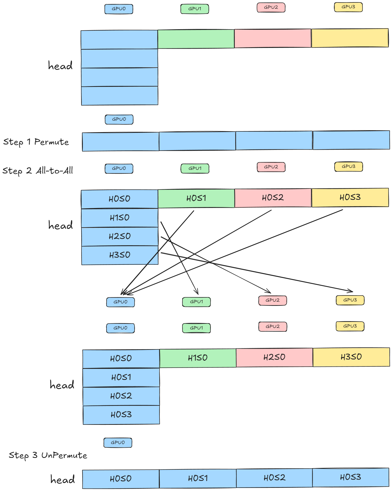