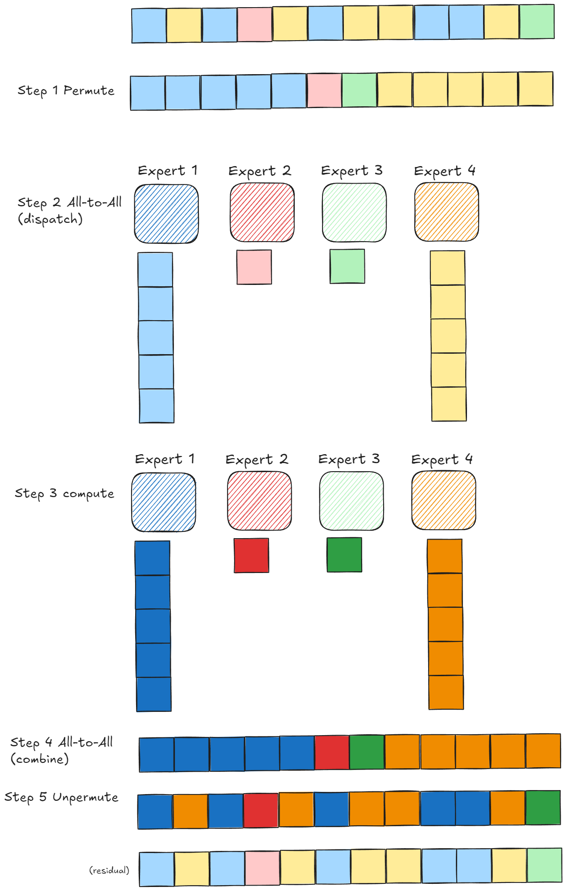
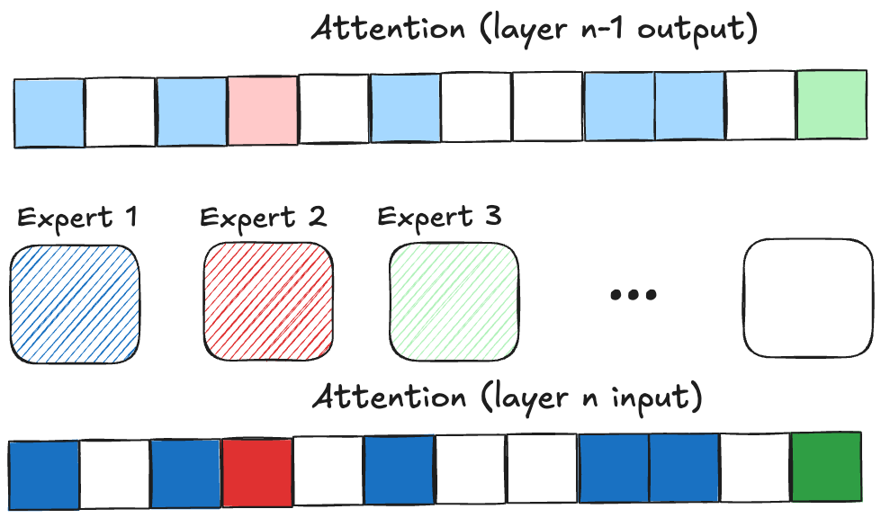
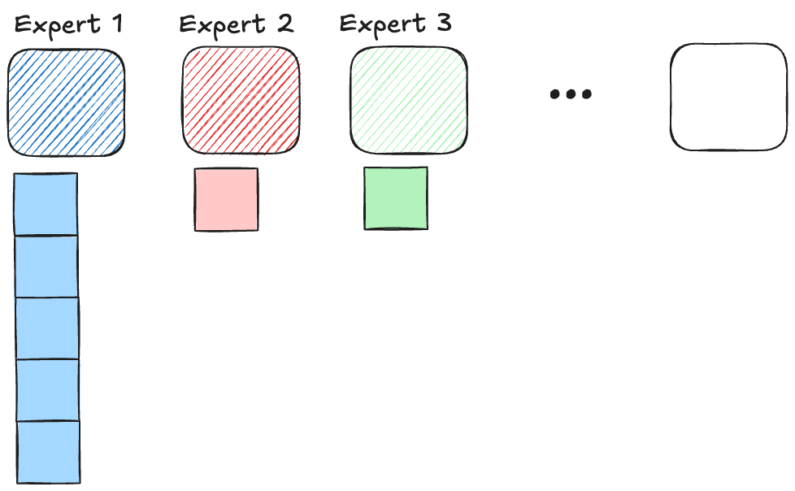
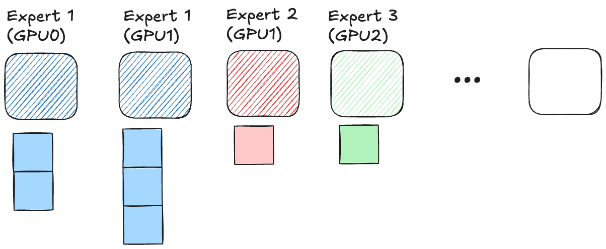
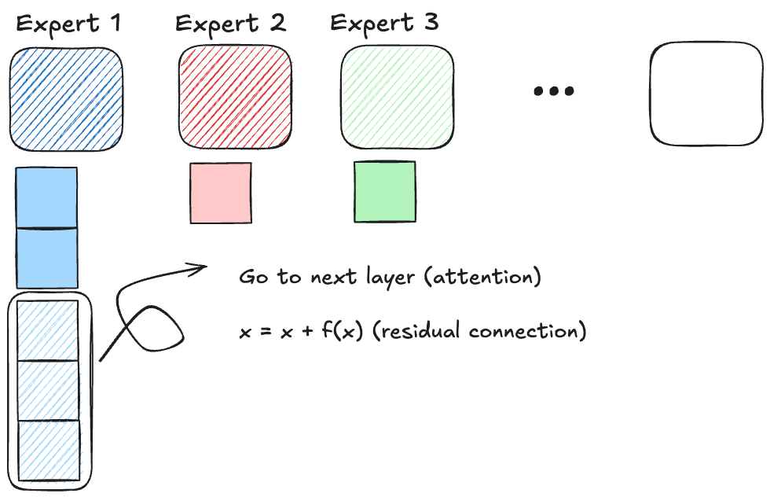

## Steps in MoE Inference 

## MoE load balance 

## Solution 1: Train with load-balancing loss
pass 
## Solution 2: Duplicate "hot" experts

## Solution 3: Token dropping

## Where to Optimize
### Fused MoE
Combine 5 steps in one kernel
### NCCL -> NVSHMEM

NCCL requires implicit synchronization across devices. 
NVSHMEM is fully-asynchronized and friendly for small packet

(similar to RDMA, first register then directly access the remote memory)

e.g. UCX/triton-distributed/DeepEP
### dynamic chunking 
#### Context Parallelism 
(Ring attention in Prefill)

#### Context Pipeline Parallelism 
(Chunked Prefill)
## New Scenario: Chunked Prefill / Context Parallel  

### Question 1: does chunking increase/decrease imbalance? 
Guess: imbalance is increased 
### Question 2: Can experts routing be predicted ?  
Expert Prefetching 
[\[2509.07379\] DuoServe-MoE: Dual-Phase Expert Prefetch and Cache Scheduling for Efficient MoE LLM Inference](https://arxiv.org/abs/2509.07379)
[\[2511.10676\] Pre-Attention Expert Prediction and Prefetching for Mixture-of-Experts Large Language Models](https://arxiv.org/abs/2511.10676)
### Question 3: Can chunking balance experts routing ? 
Guess: yes, very likely. 

