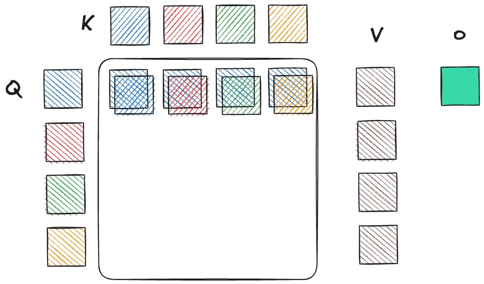
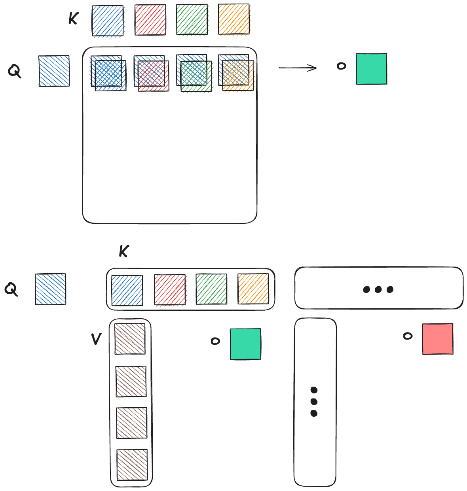
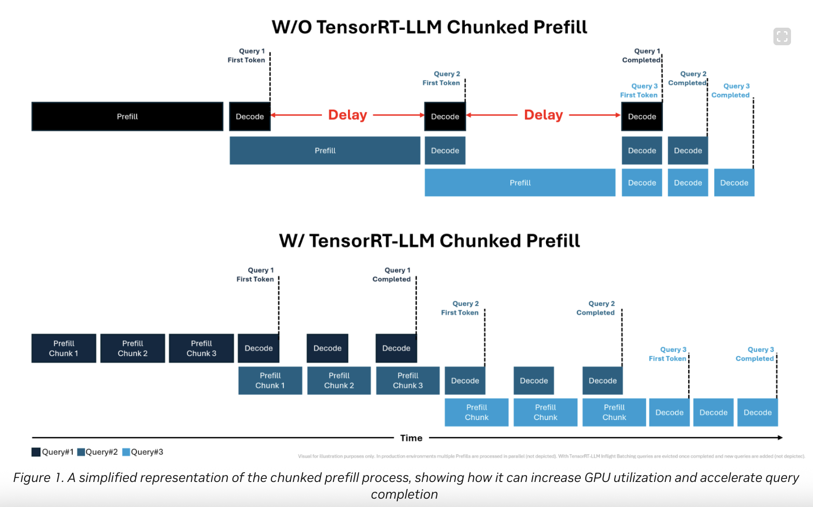
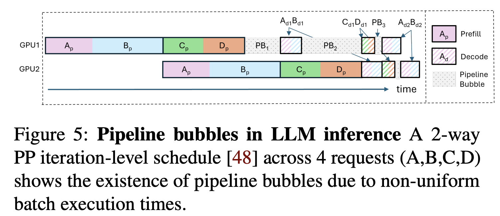
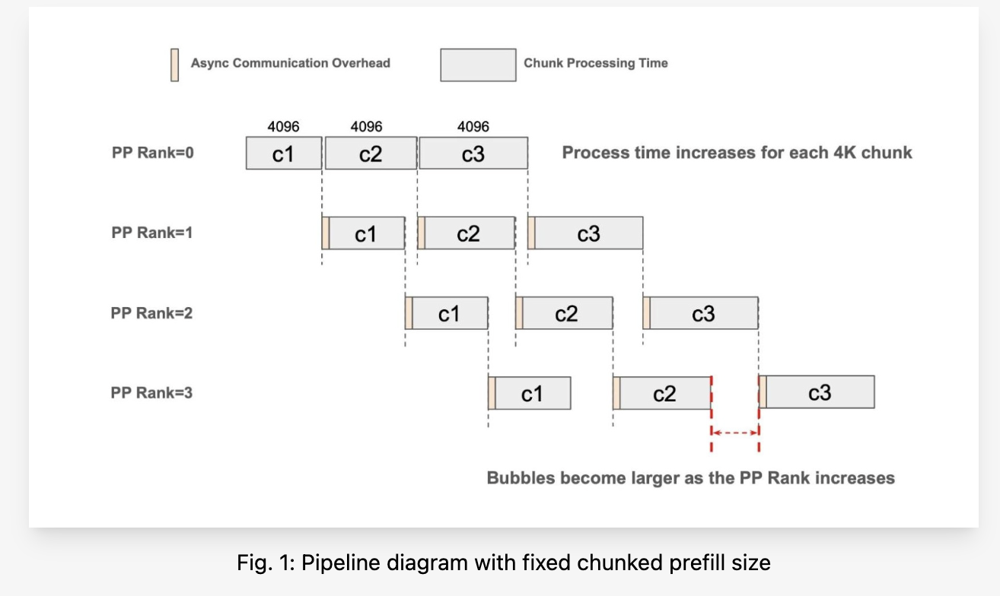
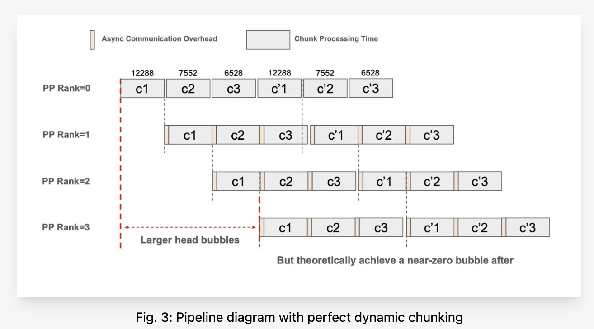
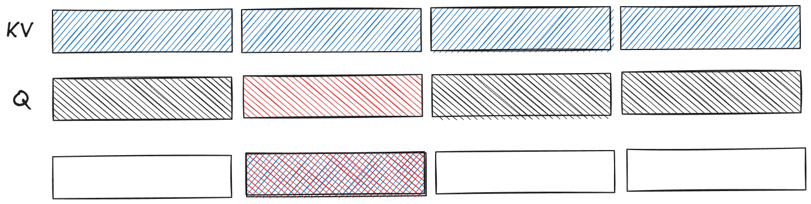
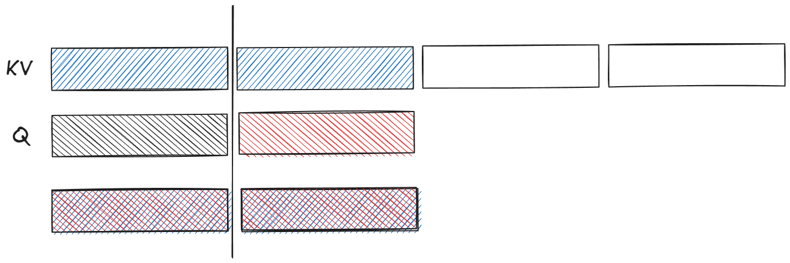

## Self Attention and KV Cache
$q \in \mathbb{R}^{m \times d}, k,v \in \mathbb{R}^{n \times d}$

$$
\begin{aligned}
\rm{Softmax}(q, k, v)&= \frac{\rm{exp}\left(qk^{\top}\right)}{\sum \rm{exp}\left(qk^{\top}\right)}v \\
&= \left(\frac{\rm{exp}\left(qk^{\top}\right)}{\sum \rm{exp}\left(qk^{\top}\right)}\right)_{m\times n}v_{n\times d} \\ 
&= \frac{\left(\rm{exp}\left(qk^{\top}\right)\right)_{m\times n}}{\left(\sum_{j}^{n} \rm{exp}\left(qk^{\top}\right)\right)_{m\times 1}}v_{n\times d}
\end{aligned}
$$

[Attention and KV Cache](Attention%20and%20KV%20Cache.md)

## Partial Attention
[Cascade Inference: Memory Bandwidth Efficient Shared Prefix Batch Decoding \| FlashInfer](https://flashinfer.ai/2024/02/02/cascade-inference.html)

To seamlessly compute attention across these physically separated tiers, we can utilize a composable {Attention State} algebra proposed by FlashInfer originally designed for Prefix Caching.

Recall that standard self-attention for a query $\mathbf{q}$ and a set of KV pairs indexed by $I$ is computed as:

$$
\begin{equation}
\text{Attention}(\mathbf{q}, I) = 
\frac{\sum_{i \in I} \exp(\mathbf{q}\mathbf{k}_{(i)}^{\top}) \mathbf{v}_{(i)}}{\sum_{j \in I} \exp(\mathbf{q}\mathbf{k}_{(j)}^{\top})}.
\end{equation}
$$

The denominator represents the total attention mass, which we term the **Sum of Exponentials** ($\rm{SE}(I)$). The numerator represents the unnormalized weighted sum of value vectors. $\mathbf{o}(I)$ is defined as the attention result restricted solely to the subset $I$:

$$\begin{equation}
\mathbf{o}(I) = \sum_{i \in I} \rm{Softmax}(\rm{SE}_{(i)})\mathbf{v}_{(i)} = \frac{\sum_{i \in I} \rm{SE}_{(i)}\mathbf{v}_{(i)}}{\rm{SE}(I)},
\end{equation}
$$

We define the **Attention State** of a tier $I$ as the tuple $\begin{bmatrix} \mathbf{o}(I) \\ \rm{SE}(I) \end{bmatrix}$, which fully encapsulates the partial computation of $I$. 
To aggregate results from multiple tiers (e.g., a Sparse Tier $I$ and a Dense Tier $J$), a binary **Merge Operator** $\oplus$ can be applied to merge the partial outputs for the complete outputs:

$$\begin{equation}
\begin{aligned}
\begin{bmatrix} \mathbf{o}(I \cup J) \\ \rm{SE}(I \cup J) \end{bmatrix} &= \begin{bmatrix} \mathbf{o}(I) \\ \rm{SE}(I) \end{bmatrix} \oplus \begin{bmatrix} \mathbf{o}(J) \\ \rm{SE}(J) \end{bmatrix} \\
&= \begin{bmatrix} \frac{\mathbf{o}(I) \rm{SE}(I) + \mathbf{o}(J) \rm{SE}(J)}{\rm{SE}(I) + \rm{SE}(J)} \\ \rm{SE}(I) + \rm{SE}(J) \end{bmatrix}.
\end{aligned}
\end{equation}$$

## Flash Attention 

### FlashAttention: The Block-Wise Derivation

In FlashAttention, we partition the total set of KV indices $I$ into $K$ disjoint blocks: $B_1, B_2, \dots, B_K$. Our goal is to compute the global attention state $\begin{bmatrix} \mathbf{o}(I) \\ \rm{SE}(I) \end{bmatrix}$ by iteratively merging the states of these blocks.
#### 1. Local Block State

For any single block $B_k$, we compute its partial Attention State. This is done locally in high-speed memory (SRAM):

$$\text{State}(B_k) = \begin{bmatrix} \mathbf{o}(B_k) \\ \rm{SE}(B_k) \end{bmatrix}$$
Where:
- $\rm{SE}(B_k) = \sum_{i \in B_k} \exp(\mathbf{q}\mathbf{k}_{(i)}^{\top} - m(I))$
- $\mathbf{o}(B_k) = \frac{\sum_{i \in B_k} \exp(\mathbf{q}\mathbf{k}_{(i)}^{\top} - m(I)) \mathbf{v}_{(i)}}{\rm{SE}(B_k)}$

Note on Numerical Stability: In practice, FlashAttention tracks a running maximum $m$ to prevent exponent overflow. For this algebraic derivation, we assume the $\rm{SE}$ terms are already scaled by a common factor for simplicity. 

--- 
#### 2. The Iterative Update (The Flash Loop)

Instead of computing all blocks and then merging them (which would require storing all intermediate $\mathbf{o}(B_k)$), FlashAttention updates a running accumulator.

Let $A^{(k)}$ be the accumulated state after processing the first $k$ blocks. We initialize with $A^{(0)} = \begin{bmatrix} \mathbf{0} \\ 0 \end{bmatrix}$. For each new block $B_{k+1}$, we apply the Merge Operator $\oplus$:

$$A^{(k+1)} = A^{(k)} \oplus \begin{bmatrix} \mathbf{o}(B_{k+1}) \\ \rm{SE}(B_{k+1}) \end{bmatrix}$$

#### 3. The Algebraic Expansion

Expanding the merge operator $\oplus$ for the $(k+1)$-th step, we get:

$$\begin{bmatrix} \mathbf{o}(A^{(k+1)}) \\ \rm{SE}(A^{(k+1)}) \end{bmatrix} = \begin{bmatrix} \frac{\mathbf{o}(A^{(k)}) \rm{SE}(A^{(k)}) + \mathbf{o}(B_{k+1}) \rm{SE}(B_{k+1})}{\rm{SE}(A^{(k)}) + \rm{SE}(B_{k+1})} \\ \rm{SE}(A^{(k)}) + \rm{SE}(B_{k+1}) \end{bmatrix}$$

This shows that the global output $\mathbf{o}(I)$ is simply a weighted average of the partial outputs from each block, where the weights are the "attention mass" (Sum of Exponentials) contributed by each block.

---
### Comparison of Perspectives

| Feature   | Cascade Attention (Your notation)                   | Flash Attention (Block-wise)              |
| --------- | --------------------------------------------------- | ----------------------------------------- |
| Hierarchy | Across different memory tiers (e.g., HBM vs. Cache) | Across sequence chunks (SRAM vs. HBM)     |
| Logic     | Parallel merge of disparate sources                 | Sequential update of sequence blocks      |
| Goal      | Heterogeneous data composition                      | Reducing memory IO (Linear vs. Quadratic) |

### Summary of the "Algebra"
>[!note]
>Important!!! the chunking is position-independent/position irrelevant!!!

The beauty of this notation is that the operator $\oplus$ is **associative**. Because $(A \oplus B) \oplus C = A \oplus (B \oplus C)$, it doesn't matter if you compute attention:

1. Sequentially (FlashAttention loop).
2. Hierarchically (Cascade Attention).
3. Distributedly (Across multiple GPUs).

As long as you track the tuple $\begin{bmatrix} \mathbf{o} \\ \rm{SE} \end{bmatrix}$, you can reconstruct the exact global attention output from any number of partial computations.

>[!question]
>What's the difference between chunked prefill and context parallelism 
 
## Chunked Prefill 
[Streamlining AI Inference Performance and Deployment with NVIDIA TensorRT-LLM Chunked Prefill \| NVIDIA Technical Blog](https://developer.nvidia.com/blog/streamlining-ai-inference-performance-and-deployment-with-nvidia-tensorrt-llm-chunked-prefill/)
TPOT time per output token 

[\[2308.16369\] SARATHI: Efficient LLM Inference by Piggybacking Decodes with Chunked Prefills](https://arxiv.org/abs/2308.16369)

## Chunked Pipeline Parallelism 
[Pipeline Parallelism in SGLang: Scaling to Million-Token Contexts and Beyond \| LMSYS Org](https://lmsys.org/blog/2026-01-15-chunked-pipeline/)

## Chunked Prefill and Context Parallelism

> [!Answer] 
> Chunked prefill save KV cache; 
> Context Parallelism save O (Attention state) cache
### Context Parallelism 

### Chunked Prefill
